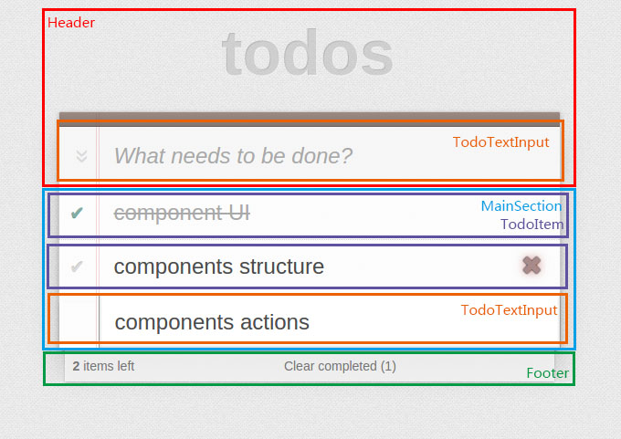

# Simple TODO with React and Flux

这是 Facebook 官方学习 Flux 的 [demo](https://facebook.github.io/flux/docs/todo-list.html)，想用这个例子来总结一下怎么从零开始用 React 和 Flux 构建一个 App 

## Structure

```javascript
App
├─ javascripts
│  ├─ actions
│  │  ├─ TodoActions.js
│  ├─ components
│  │  ├─ TodoComponents
│  │  │  ├─ TodoApp.js
│  │  │  ├─ Header.js
│  │  │  ├─ MainSection.js
│  │  │  ├─ Footer.js
│  │  │  ├─ TodoItem.js
│  │  │  ├─ TodoTextInput.js
│  ├─ constants
│  │  ├─ TodoConstants.js
│  ├─ dispatcher
│  │  ├─ AppDispatcher.js
│  ├─ stores
│  │  ├─ TodoStore.js
├─ stylesheets
│  ├─ TodoStyle.css
├─ index.html
├─ README.md
├─ package.json
├─ webpack.config.js
```

可能你看到的这个结构和官方 demo 的结构会有点不同，那是因为官方的 demo 整个的本身只有 todo 这个功能，但实际上远远不至。所以在 components 下会细分是什么部分的组件，像 TodoComponents

关于 Flux 里的 Action, Dispatcher, Store and Controller View 这些概念如果还不了解的话可以去看看这两篇文章

- [Flux For Stupid People](http://blog.andrewray.me/flux-for-stupid-people/)
- [Getting To Know Flux, the React.js Architecture](https://scotch.io/tutorials/getting-to-know-flux-the-react-js-architecture)

## Components

首先你通过你 app 的界面来确定你的组件，如下图



从这个图我们可以看到，我们的组件有

- Header
- MainSection
- Footer
- TodoItem
- TodoTextInput

在 MainSection 里有 TodoTextInput 是当我们双击我们已经存在的 todo，可以对其进行更新

## Actions

确定了组件之后，我们就可以确定我们的 TodoActions 文件了。

对于这个 Todo app，有多少 actions 呢？

- `create` － 我们可以创建一条新的 todo
- `updateText` - 双击已经存在的 todo，可以对其进行更新
- `toggleComplete` - 看到每一条前面的勾勾了吗？就是可以给你决定是否完成了
- `toggleCompleteAll` - 看到输入框前面那个 » 了吗？就是让你全部完成，或者全部不完成的
- `destroy` - 看到每一条后面那个叉叉了吗？要 hover 在上面才看到的，就是给你删除这一条的
- `destroyCompleted` - 看到 Footer 下面那个 Clear completed 了吗？就是给我们删除已经完成的 todo 的

就是这样，我们根据我们的需求在这个文件里定义不同的 action 函数，但这里的函数并不涉及逻辑的处理，这里函数只是告诉我们的 Dispatcher，用户进行了什么操作。所以我们只需要给 Dispatcher 传的一个对象，对象里一个必要的属性就是 actionType。如果用户进行这个操作有给我们传的参数的话。那参数也会放在这个对象里。

例如用户想创建一条新的 todo ，就是我们的 `create` action 了

```javascript
import AppDispatcher from '../dispatcher/AppDispatcher';
import TodoConstants from '../constants/TodoConstants';

var TodoActions = {
  create (text) {
    AppDispatcher.dispatch({
      actionType: TodoConstants.TODO_CREATE,
      text: text
    });
  },
  // other actions
}

export default TodoActions;
```

当我们执行 AppDispatcher.dispatch 这个方法，并传给他一个有 actionType 属性的对象时，他就会在大喊，“有人做了一个操作呀，这个操作就是 xxx (actionType 的值)，还带了个参数，你们哪个来处理一下呀”

嗯嗯，就是这样，数据就从 Action 传到了 Dispatcher

## Dispatcher

Dispatcher 的具体实现可以看[这里](https://github.com/facebook/flux/blob/master/src/Dispatcher.js)

当我们用 Facebook 给我们提供的 Dispatcher，那么一切都会变得简单了许多

```bash
npm install --save flux
```

```javascript
import Flux from 'flux';

var Dispatcher = Flux.Dispatcher;

export default new Dispatcher();
```

Dispatcher 在整个应用

只有一个，只有一个，只有一个

有人就说了，你 Dispatcher 只负责喊的，我不要你也好像可以呀。嗯嗯，那就不叫 Fulx 了，叫 [Reflux](https://github.com/spoike/refluxjs)

## Constants

刚刚我们看到在我们的 Actions 里，`actionType: TodoConstants.TODO_CREATE`，这个 TodoConstants 其实就是我们操作的名字，相当于一个常量，定义在 Constants 里方便管理和调用而已。

一般你有多少个 action，就有多少个常量在这个 Constants 里

[KeyMirror](https://github.com/STRML/keyMirror)

就是创建一个对象，里面键的值等于键的名字 - -
      
## Stores

主角登场！ 但， Store 是什么？

### Store 是一个保存数据的地方

```javascript
var _todo = {};
```

### Store 是一个充满逻辑的地方

所有 actions 的逻辑处理，都会在这里发生。像我们的 `create` action

```javascript
function create (text) {
  var id = (new Date() + Math.floor(Math.random() * 999999)).toString(36);
  _todos[id] = {
    id: id,
    complete: false,
    text: text
  };
}
```
### Store 是一个响应 Dispatcher 呼喊的地方

> “有人做了一个操作呀，这个操作就是 xxx (actionType 的值)，还带了个参数，你们哪个来处理一下呀”

在 Store 里，我们通过 Dispatcher “注册”了一个回调函数，每当我们调用 dispatch 函数的时候，就是 Dispatcher 大喊的时候，我们根据不同的 actionType，来调用我们不同的逻辑处理函数，像这样

```javascript
import AppDispatcher from '../dispatcher/AppDispatcher';
import TodoConstants from '../constants/TodoConstants';

AppDispatcher.register((action) => {
  var text;

  switch(action.actionType) {
    case TodoConstants.TODO_CREATE:
      text = action.text.trim();
      if (text !== '') {
        create(text);
        TodoStore.emitChange();
      }
      break;

    // other case
  }
});
```

### Store 是一个鞭策 Controller View 改变的地方

每当 Store 改变了数据之后，他都要 Controller View 跟着他改变。他们还约定了暗号

```javascript
var CHANGE_EVENT = 'change';
```

Store 跟 Controller View 说，我一喊 “变”，你听到之后，你就叫你的手下一起变。

Controller View 说好。

但是 Store 不会喊，Controller View 也听不到。

所以 Store 从 `EventEmitter`中学会了喊，也给 Controller View 买来了助听器

```javascript
import assign from 'object-assign';

var EventEmitter = require('events').EventEmitter;

var TodoStore = assign({}, EventEmitter.prototype, {
  areAllComplete () {
    for (var id in _todos) {
      if (!_todos[id].complete) {
        return false;
      }
    }
    return true;
  },
  getAll () {
    return _todos;
  },
  emitChange () {
    this.emit(CHANGE_EVENT);
  },
  addChangeListener (callback) {
    this.on(CHANGE_EVENT, callback);
  },
  removeChangeListener (callback) {
    this.removeListener(CHANGE_EVENT, callback);
  }
});

export default TodoStore;
```

所以每当执行完逻辑处理函数之后，Store 都会喊一句 `TodoStore.emitChange();`

助听器 `addChangeListener (callback) { this.on(CHANGE_EVENT, callback) }` 也买好了，成不成功，就看 Controller View 了

## Controller View

在 Components 里，你看不到 TodoApp 这个组件，因为对于 Todo 这个 App，TodoApp 这个组件，就是 Contriller View，他掌管全部的 Components。

但是重要的是，他怎么带 Store 给他买的助听器

```javascript
componentDidMount () {
  TodoStore.addChangeListener(this._onChange.bind(this));
}
```

当组件渲染完成后，就绑定了 Store 的 `addChangeListener`，并回调了自己的 `onChange` 方法。

```javascript
_onChange () {
  this.setState(this.getTodoState.bind(this)());
}
```

Store 一喊，Controller View 听到之后，更新所有数据，以 `props` 的方式传给他的手下 - 即他掌管的 Components

## Summary

现在我们来疏理一下整个流程(就 create 而言)

1. 用户输入要新增的 todo，一敲回车，触发 `onKeydown` 方法。
2. `onKeydown` 调用了 `onSave` 方法，`onSave` 调用了 `TodoActions.create` 方法。
3. `TodoActions.create` 触发了 `AppDispatcher.dispatch` 方法，AppDispatcher 大喊了一声。
4. TodoStore 响应，根据 actionType 调用了 `create` 逻辑处理函数，执行完，喊了一句 “变”。
5. Controller View 带着助听器听到了接着更新数据，把数据传给了各个 Components。
6. 重新渲染，新增完毕。

以上是本人浅显的理解，如有错误，欢迎指正 :)
